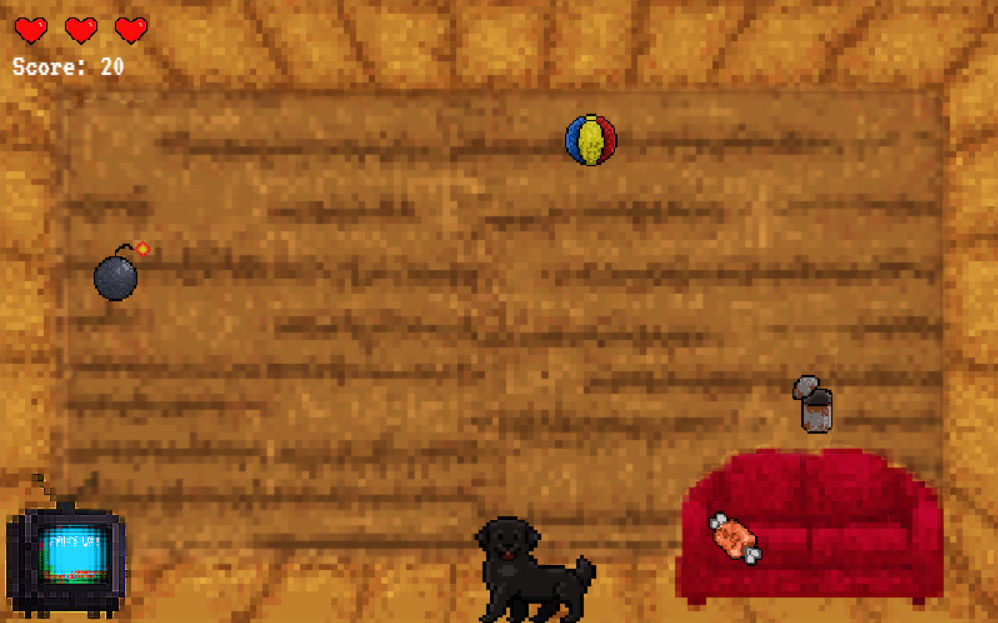

# 🎮 **Paws Up!** 

> **Short Pitch**: Paws Up! is a fast-paced, pixel-art arcade game where you play as Fee, an adorable lab, racing to catch falling treats while dodging gross, dangerous, and downright silly items.

---

## 🌐 **Play the Game**
[Click here to play the game!](https://flomadner.github.io/repository-name)

---

## 📸 **Screenshots**

### Main Gameplay:

  
  
*Figure 1: Example of gameplay in action.*

---

### Menu and UI:

  
  
*Figure 2: Menu and user interface.*

---

## 🎨 **Spritesheets**
Below are the sprites used to create characters and objects in the game:

### Player Character:

  
  
*Figure 3: Player character animations.*

---

### Enemies and NPCs:

  
  
*Figure 4: Enemy animations.*

---

## ✍️ **Reflection**

### What went well:
- **Item mechanics:** Implementing different items with different characteristics made a lot of fun.
- **Sprites:** The implementation of the sprites went surprisingly smooth.

### Challenges:
- **Having a plan:** Figuring out what to prioritize/whats the most important to implement first.
- **Not being overwhelmed:** In the beginning I struggled with that since it seemed like everyone else had a plan and more skills, but as the week went on I became more confident and I also learned a lot.
- **Animations on Start/Gameover screens:** It took a long time to figure out how to have Fee animated on those screens.

### Lessons Learned:
- **Don´t be afraid to ask for help:** No one expects you to suddenly be a programming master and others won´t judge you for it.
- **Keep it Simple:** Start with the basic mechanics. Once you have those down you can always add more features.
